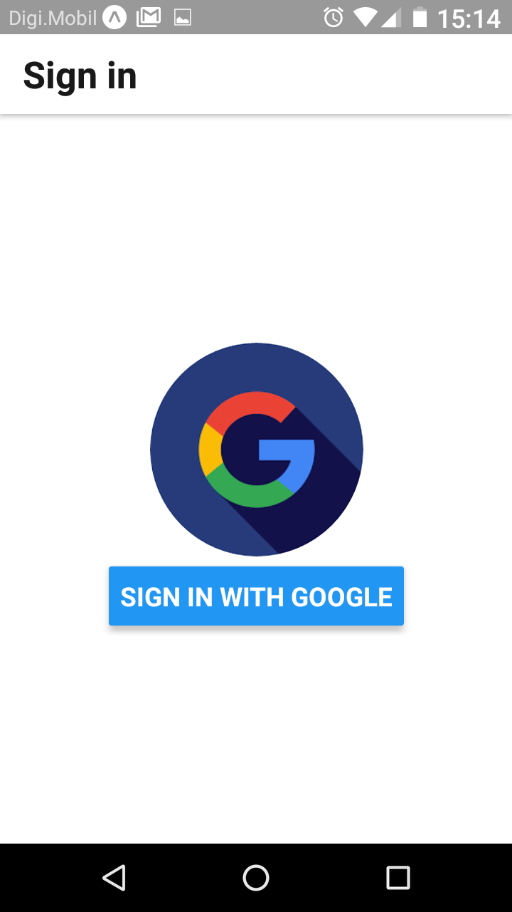

<h1>Google Drive API Wrapper for React Native Applications</h1>

Communicates with Google drive through this package. 

<h2 style='color:blue'>Give a donation and i will send full development manual, test application runing with this API Wrapper and remote support.</h2>

 <table>
   <tr>
     <td>
       
     </td>
     <td>
       
     </td>
   </tr>
   <tr>
     <td>
        
     </td>
     <td>
        
     </td>
     </tr>
   <table>

<h3>Donate in Patreon</h1>

  <b>Tier:</b>
  <pre><a href='https://bit.ly/2wzXPKQ'>https://bit.ly/2wzXPKQ</a></pre>

<h3>Donate Some Crypto</h1>

  <b>BITCOIN:</b>
  <pre>17nunWK3iF6vMav7aZV1s9jJTgNSBQiakr</pre>

  <b>ETHER:</b>
  <pre>0x1DF4dc4Da9563Eaa388E17FC441068dBd1587587</pre>
  
  <b>BITCOIN CASH:</b>
  <pre>qp98lzgt8dcuhfvxdv25wlr6eu6zapaajy6h38vg3g</pre>

<h1>Import and call methods</h1>
<h4>Import in your react native application.</h4>
<pre>
import {GoogleDrive} from 'react-native-google-drive-api';
</pre>

  

The follow methods are available:

<h4>Set Access Token</h4>
<pre>
GoogleDrive._setAccessToken(myAccessToken);
</pre> 
 

<h4>Get Access Token</h4>
<pre>
GoogleDrive._getAccessToken();
</pre> 
 

<h4>About</h4>
<pre>
GoogleDrive._about([{name:'fields',value:'user,storageQuota'}]).then((responseAbout)=>
      { 
          console.log(responseAbout)                 
      }); 
</pre> 
 
<h4>Changes</h4>

getStartPageToken

<pre>
GoogleDrive._changes_getStartPageToken([]).then((responseStartPageToken)=>
      { 
          if(this.state.loaded==false)
          {
            this.setState({responseStartPageToken:responseStartPageToken,loaded:true})
          }                  
      }); 
</pre>

list

<pre>
GoogleDrive._changes_list([{'name':'pageToken','value':pageToken}]).then((responseList)=>
      { 
          if(this.state.loaded==false)
          {
            this.setState({responseList:responseList,loaded:true})
          }                  
      }); 
</pre>

watch

<pre>
GoogleDrive._changes_watch([{'name':'pageToken','value':pageToken}]).then((responseWatch)=>
      { 
          if(this.state.loaded==false)
          {
            this.setState({responseWatch:responseWatch,loaded:true})
          }                  
      }); 
</pre>
 
<h4>Channels</h4>
<pre>

</pre>
 
<h4>Comments</h4>
<pre>

</pre>
 
<h4>Files</h4>
<pre>

</pre>
 
<h4>Permissions</h4>
<pre>

</pre>
 
<h4>Replies</h4>
<pre>

</pre>
 
<h4>Revisions</h4>
<pre>

</pre>
 
<h4>Teamdrives</h4>
<pre>

</pre>

